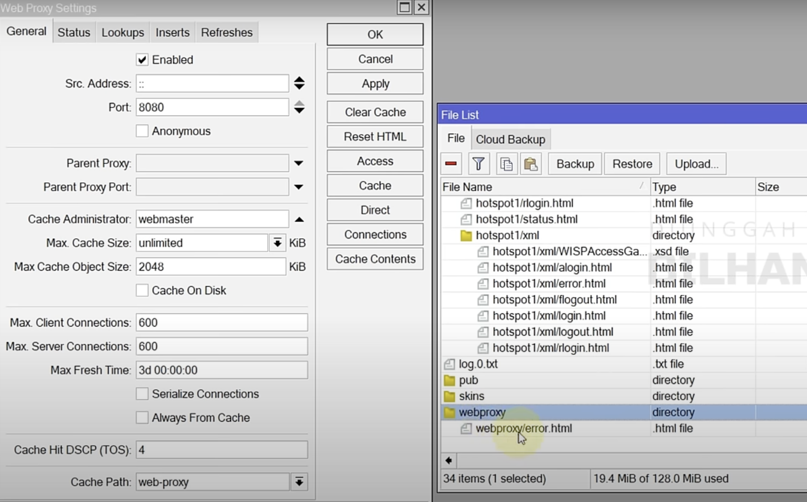

# isolirMikrotik

### LANGKAH #1:  
Buat IP Pool baru khusus untuk client PPPoE yang akan diisolir, untuk IP address bisa dipisahkan atau disamakan dengan IP PPPoE yang sudah ada.  
* /ip pool add name=POOL-ISOLIR ranges=172.16.0.2-172.16.0.254  

### LANGKAH #2: Buat Profile PPP baru khusus untuk isolir.  
* /ppp profile add name=PROFIL-ISOLIR local-address=172.16.0.1 remote-address=POOL-ISOLIR address-list=ISOLIR-LIST  

### LANGKAH #3: Aktifkan Web Proxy dan Atur Port.  
* /ip proxy set enabled=yes port=8080  
* /ip proxy access add comment="Blok PPPoE Isolir - TESTNET" src-address=172.16.0.0/24 dst-address=!172.16.0.1 action=deny redirect-to=172.16.0.1:8080  

### LANGKAH #4: Buat notifikasi ke perangkat client (HP / PC) bahwa akses internet telah diisolir.  
*   
* /ip firewall nat add comment="Notif Redirect PPPOE Isolir - TESTNET" chain=dstnat protocol=tcp dst-port=80,443 src-address-list=POOL-ISOLIR action=redirect to-ports=8080  

### LANGKAH #5: Buat rule untuk memblokir semua akses internet khusus ke PPPoE yang terisolir.  
*   
*   
* /ip firewall filter add comment="Blok Internet ke PPPoE Isolir - TESTNET" chain=forward src-address-list=ISOLIR-LIST action=drop  

### LANGKAH #6: Reset dan Hapus File error.html bawaan Mikrotik.  
*   
*   
*   

### drag file isolir.html ke web proxy  
*   

* /ip proxy reset-html  
y  
* /file remove webproxy/error.html
